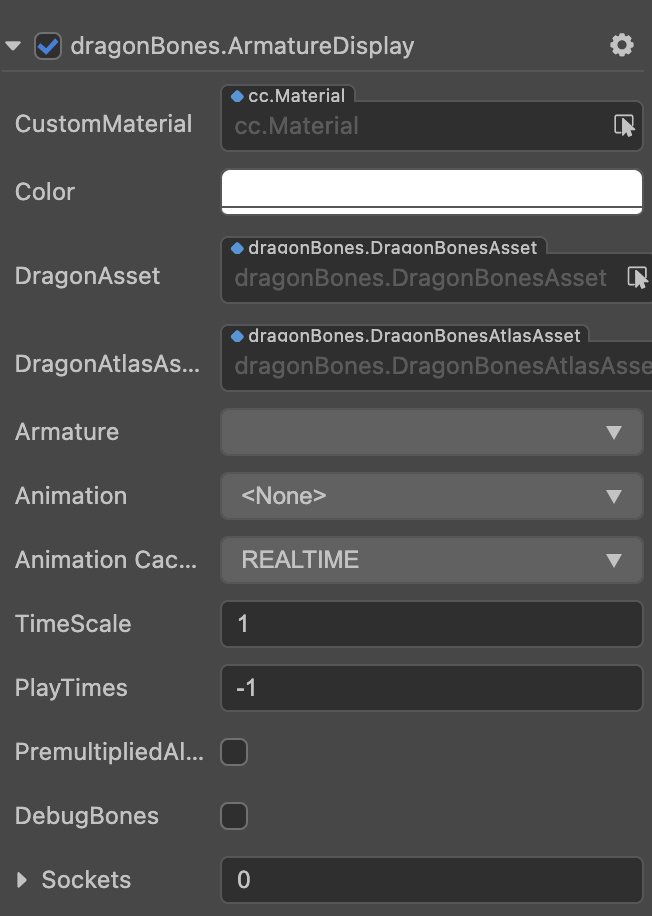
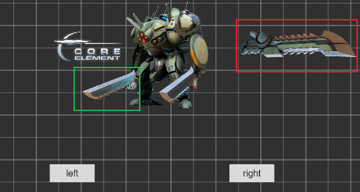
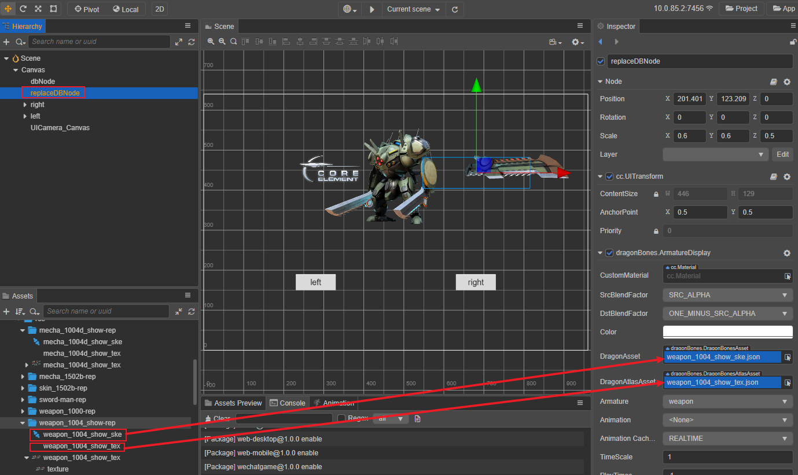
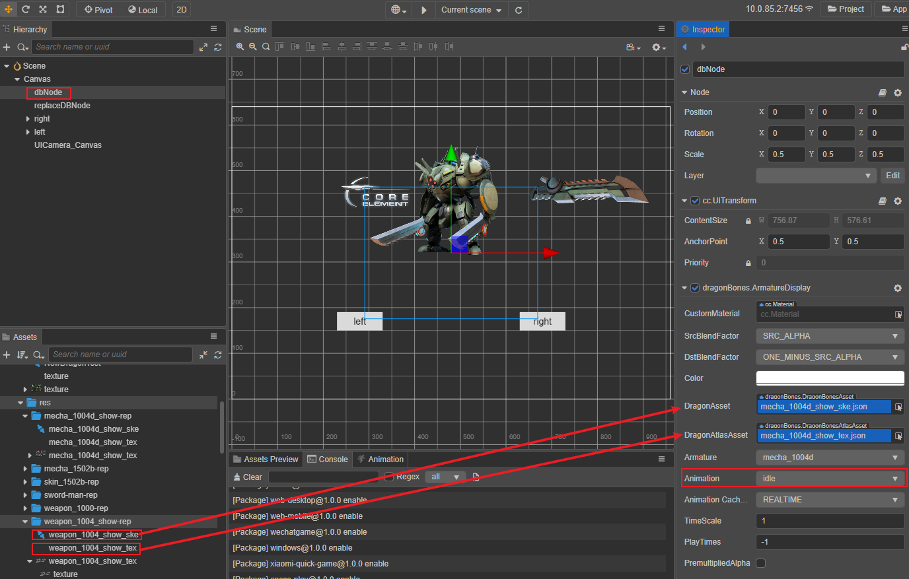
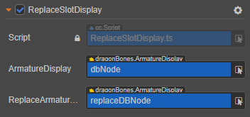
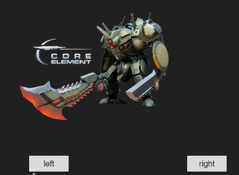

# DragonBones ArmatureDisplay Component References

The ArmatureDisplay component can render and play DragonBones assets.



In the **Hierarchy** panel, select the node where you want to add the ArmatureDisplay component, and then click the **Add Components -> Components -> ArmatureDisplay** button under the **Inspector** panel to add the ArmatureDisplay component to the node.

- Please refer to the [DragonBones test case](https://github.com/cocos-creator/test-cases-3d/tree/v3.0/assets/cases/dragonbones) in [example-cases](https://github.com/cocos-creator/example-cases) for the operation of the ArmatureDisplay component in the script.
- For DragonBones related scripting interface, please refer to the [DragonBones API](__APIDOC__/zh/modules/dragonBones.html).

## DragonBones Properties

| Property | Description
| :-------- | :---------- |
| CustomMaterial        | Custom material
| Color                 | Color settings
| Dragon Asset          | Skeletal information data that contains skeletal information (bound skeletal actions, slots, render order, attachments, skins, etc.) and animations, but does not hold any state. <br>Multiple ArmatureDisplays can share the same skeletal data. <br/>Skeletal assets exported by DragonBones can be dragged and dropped here.
| Dragon Atlas Asset    | The Atlas Texture data needed for the skeleton data. Drag and drop DragonBones exported Atlas assets here.
| Armature              | The name of the Armature currently in use
| Animation             | Name of the currently playing animation
| Animation Cache Mode  | Rendering mode, default `REALTIME` mode. <br>1. **REALTIME** mode, real-time computing, supports all DragonBones features. <br>2. **SHARED_CACHE** mode, caches and shares skeletal animations and texture data, equivalent to pre-baked skeletal animations. Has higher performance, but does not support action fusion, action overlay, skeleton nesting, and only supports action start and end events. As for memory, it has a memory advantage when creating N(N>=3) animations with the same skeleton and the same action, the larger the N value, the more obvious the advantage. In summary, `SHARED_CACHE` mode is suitable for scene animations, effects, replica monsters, NPCs, etc., and can greatly improve frame rates and reduce memory consumption. <br>3. **PRIVATE_CACHE** mode, similar to `SHARED_CACHE` but does not share animation and texture data, so there is no memory advantage, only performance advantage. If you want to take advantage of the high performance of the cache mode, and also want to implement skins function (cannot share the texture data), then `PRIVATE_CACHE` is for you.
| Time Scale            | The time scale of all animations in the current skeleton
| Play Times            | The number of cycles to play the default animation. <br>**-1** means use the default value in the configuration file;<br>**0** means infinite loop;<br>**>0** means loop times
| PremultipliedAlpha    | Whether the image is enabled for texture pre-multiplied, default is True.<br>This item needs to be turned off when the transparent area of the image appears color blocked. <br>Enabled when the translucent areas of the image become black.
| DebugBones            | Whether to show debug information for bone
| Sockets               | A attachment system for attaching certain external nodes to a given bone joint

> **Note**: the **Anchor** and **Size** properties on the Node component in the **Inspector** panel are disabled when using the ArmatureDisplay component.

## DragonBones Skins

The following is an example of how DragonBones implement skins function. Replace the weapon in the green box below with the knife in the red box by replacing the display object of the slot.



1. First create a new empty node in the **Hierarchy** panel and rename it to `replaceDBNode`. then add ArmatureDisplay component in **Inspector** panel. And drag and drop the assets of the knife in the red box to the properties box of the ArmatureDisplay component, as follows:

    

2. Create another empty node and rename it to dbNode, then add the ArmatureDisplay component to the **Inspector** panel and drag the robot's assets to the ArmatureDisplay component's property box as shown below. The Animation property of the ArmatureDisplay component can be changed to set the animation that the developer wants to play.

     

3. Create a new TypeScript script in the **Assets** panel to write the component script. The script code is as follows:

    ```ts
    import { _decorator, Component, dragonBones } from 'cc';
    const { ccclass, property } = _decorator;

    @ccclass('ReplaceSlotDisplay')
    export class ReplaceSlotDisplay extends Component {

        @property({ type: dragonBones.ArmatureDisplay })
        armatureDisplay: dragonBones.ArmatureDisplay | null = null
        @property({ type: dragonBones.ArmatureDisplay })
        replaceArmatureDisplay: dragonBones.ArmatureDisplay | null = null;


        _leftWeaponIndex = 0;
        _rightDisplayIndex = 0;
        _rightDisplayNames:string[] = [];
        _rightDisplayOffset:{x: number, y: number}[] = [];

        start () {
            this.replaceArmatureDisplay!.node.active = false;
            this._leftWeaponIndex = 0;
            this._rightDisplayIndex = 0;
            this._rightDisplayNames = ["weapon_1004_r", "weapon_1004d_r"];
            this._rightDisplayOffset = [{ x: 0, y: 0 }, { x: -60, y: 100 }];
        }

        left () {
            let armature = this.armatureDisplay!.armature();
            let slot = armature.getSlot("weapon_hand_l");
            slot.displayIndex = slot.displayIndex == 0 ? 4 : 0;
        }

        right () {
            this._rightDisplayIndex++;
            this._rightDisplayIndex %= this._rightDisplayNames.length;
            let armature = this.armatureDisplay!.armature();
            let slot = armature.getSlot("weapon_hand_r");
            const displayName = this._rightDisplayNames[this._rightDisplayIndex];
            let factory = dragonBones.CCFactory.getInstance() as any;
            factory.replaceSlotDisplay(this.replaceArmatureDisplay!.getArmatureKey(), "weapon", "weapon_r", displayName, slot);

            let offset = this._rightDisplayOffset[this._rightDisplayIndex];
            slot.parent.offset.x = offset.x;
            slot.parent.offset.y = offset.y;
            armature.invalidUpdate();
        }
    }
    ```

4. Then attach the script component to the Canvas node, i.e. drag and drop the script into the **Inspector** panel of the Canvas node. Then drag and drop the dbNode node and replaceDBNode node from the **Hierarchy** panel into the corresponding property boxes of the script component and save the scene.

    

5. Click the Preview button at the top of the editor and click the right button in the scene to see that the knife in the robot's right hand has been replaced.

    

## DragonBones Attachment Slots and Collision Detection

DragonBones attachment slots and collision detection are done in exactly the same way as Spine, see [Spine Attachment Slots and Collision Detection](./spine.md).
