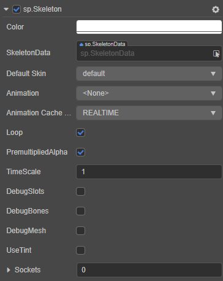
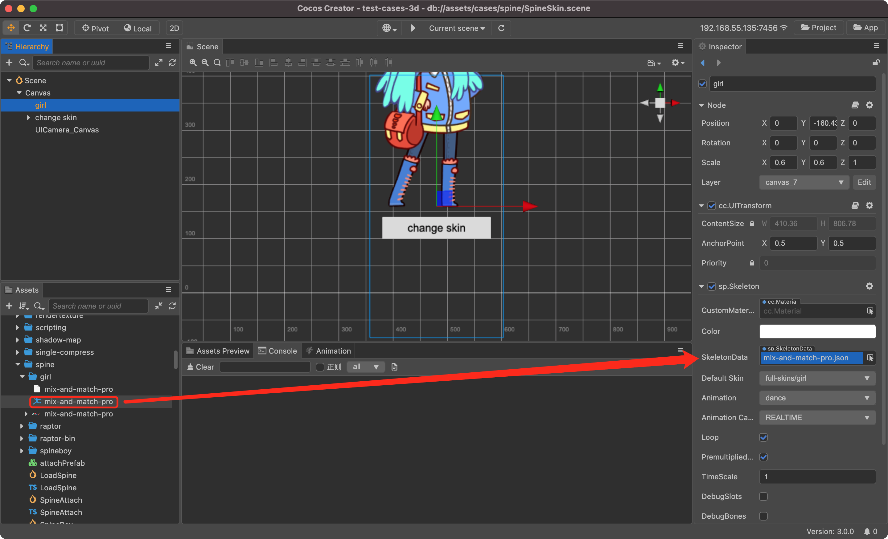
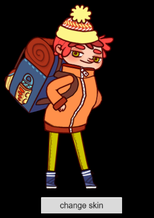
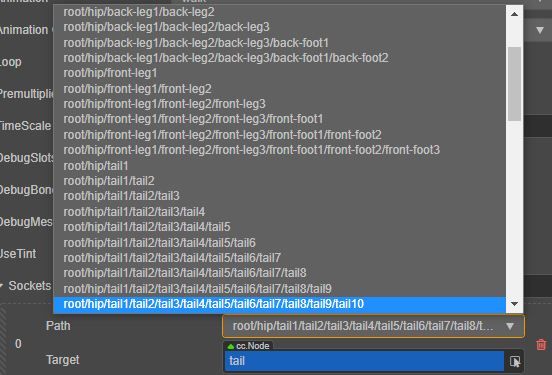
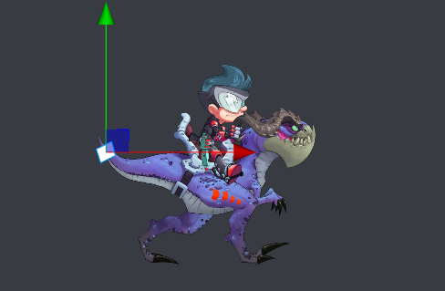
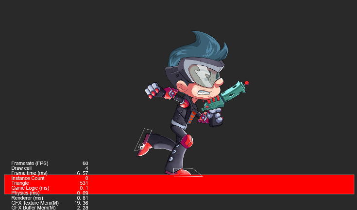
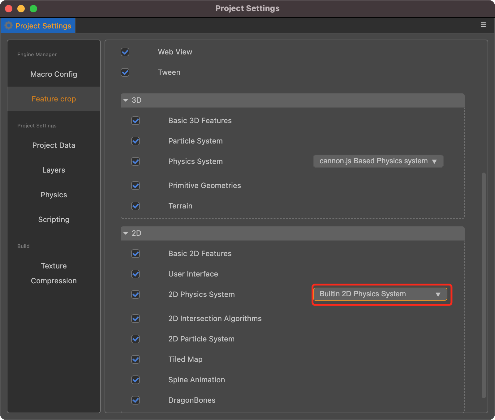
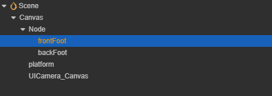
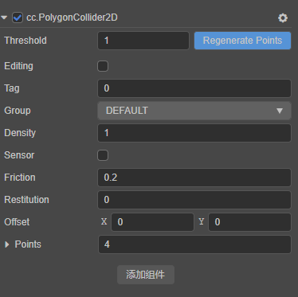

# Spine (Skeletal Animation) Skeleton Component References

The Spine Skeleton components support the data format exported by the official Spine tools, and renders and plays Spine assets.



Select the node and choose **Add Component -> Spine -> Skeleton** on the **Inspector** panel to add the Skeleton component to the node.

Please refer to [Skeleton API](../../../api/zh/classes/Skeleton.html) for the scripting interface of Spine.

## Spine Properties

| Property | Function Description
| :-------------------- | :----------------- |
| Color                 | Color Settings
| SkeletonData          | Skeleton information data, drag and drop the skeleton assets exported from Spine. into this property
| Default Skin          | Select the default skin.
| Animation             | The name of the currently playing animation.
| Animation Cache Mode  | Rendering mode, the default is `REALTIME` mode. <br>1. **REALTIME** mode, real-time computing, supports all Spine features. <br>2. **SHARED_CACHE** mode, caches and shares skeletal animations and texture data, equivalent to pre-baked skeletal animations. Has higher performance, but does not support motion fusion, motion overlay, and only supports motion start and end events. As for memory, when creating N(N>=3) animations with the same skeleton and the same action, the memory advantage is obvious. In summary, `SHARED_CACHE` mode is suitable for scene animations, effects, replica monsters, NPCs, etc., and can greatly improve frame rates and reduce memory consumption. <br>3. **PRIVATE_CACHE** mode, similar to `SHARED_CACHE` but does not share animation and texture data, so there is no memory advantage, only performance advantage. If you want to take advantage of the high performance of the cache mode, but also want to realize the dressing function (the texture data cannot be shared), then `PRIVATE_CACHE` is for you.
| Loop                  | Whether to loop the current animation.
| Premultiplied Alpha   | Whether to enable premultiplied alpha for the image, default is True.<br>This item needs to be disabled when the transparent area of the image appears as a color block, and enabled when the translucent area of the image turns black.
| Time Scale            | The time scale of all animations in the current skeleton.
| Debug Slots           | Whether to show debug information of slots.
| Debug Bones           | Whether to show debug information of skeletons.
| Debug Mesh            | Whether to show debug information of mesh.
| Use Tint              | Whether to turn on the tinting effect, off by default.
| Sockets               | A system for hooking up external nodes to a given bone joint.

> **Note**: the **Anchor** and **Size** properties on the Node component in the **Inspector** panel are invalid when using the Skeleton component.

## Spine Skins

The following is an example of how to change skins in Spine.


First create a new empty node in the **Hierarchy** panel and rename it to "girl". Add the Skeleton component in the **Inspector** panel and drag and drop the asset into the SkeletonData property box of the Skeleton component. The Animation property of the Skeleton component can be changed to set the animation that the developer wants to play.



1. Create a new TypeScript script in the **Assets** panel to write the component's script. The script code is as follows:

    ```ts
    import { _decorator, Component, sp } from 'cc';
    const { ccclass, property } = _decorator;

    @ccclass('SpineSkin')
    export class SpineSkin extends Component {


        @property({ type:sp.Skeleton })
        spine: sp.Skeleton | null = null;

        skinId: number = 0;

        start () {
            // Your initialization goes here.
        sp.Skeleton }

        change() {
            const skins = ['girl', 'boy', 'girl-blue-cape', 'girl-spring-dress'].map(x=> `full-skins/${x}`);
            this.skinId = (this.skinId + 1) % skins.length;
            this.skin!.setSkin(skins[this.skinId]);
        }

        // update (deltaTime: number) {
        // // Your update function goes here.
        // }
    }
    ```

2. Then attach the script component to the relevant node (here the Button component's click event is used to trigger the script's change callback).

    

3. Click the preview button at the top of the editor, and click the change skin button then you can see that the character's skin has been replaced.

    

## Spine Vertex Effect

The vertex effect is only available when Spine's `Animation Cache Mode` is in the **REALTIME** mode. Here is an example of how to set the vertex effect in Spine.

1. First, create a new empty node in the **Hierarchy** panel and rename it. Then add the Skeleton component in the **Inspector** panel, drag and drop the asset to the SkeletonData property box of the Skeleton component, and set the Skeleton component properties.

2. Create a new TypeScript script in the **Assets** panel and write the component script. The script code is as follows:

    ```ts
    import { _decorator, Component, sp } from 'cc';
    const { ccclass, property } = _decorator;

    @ccclass('SpineExample')
    export class SpineExample extends Component {

        @property({ type:sp.Skeleton })
        spine: sp.Skeleton | null = null;

        skinId: number = 0;

        start () {
            this._jitterEffect = new sp.VertexEffectDelegate();
            // Set the jitter parameters.
            this._jitterEffect.initJitter(20, 20);
            // Call the setVertexEffectDelegate method of the Skeleton component to set the effect.
            this.skeleton.setVertexEffectDelegate(this._jitterEffect);
        }
    });
    ```

3. Then attach the script component to a Canvas node or other node, i.e. drag and drop the script into the node's **Inspector** panel. Then drag and drop the node in the **Hierarchy** panel to the corresponding spine property box of the script component, and save the scene.

4. Click the Preview button at the top of the editor to see the effect of vertex jitter of the Spine animation. For the code, please refer to the [SpineMesh](https://github.com/cocos-creator/test-cases-3d/tree/v3.0/assets/cases/spine) example.

## Spine Attachment Slots

When using skeletal animation, you often need to attach a node on a part of the skeletal animation to achieve the effect of linking the node with the skeletal animation. Here is an example of how Spine can use attachment slots to attach stars to the dragon's tail, front claws and character's hands, and wiggle them along with the Spine node.


### Implement Spine Attachment Slots via Cocos Creator

1. First create an empty node in the **Hierarchy** panel and rename it. Select the node and add the Skeleton component to the **Inspector** panel, drag and drop the asset into the SkeletonData property box of the Skeleton component and set the Skeleton component properties. 

2. Then right-click on the Spine node in the **Hierarchy** panel and select **Create -> UI Render -> Sprite** to add a child Sprite node (tail, hand and claw nodes in the image below) to it.

    

3. Select the Spine node in the **Hierarchy** panel for which you want to set the attachment slot, and add the slot's information to the child node by setting Sockets in the **Inspector** panel (the value of Sockets represents the number of attachment slots).

    

4. Set the Path and Target of Sockets, select the location and child node object you want to attach respectively.

    

    You can see that a Sprite has been attached on the tail of the dragon in the **Scene** panel, and the same for the other attachment slots.

    The same goes for the other attachment slots.
    
    

5. Finally, drag the star asset to the Sprite component's `SpriteFrame` property. Save the scene and click the preview button at the top of the editor to see the star hanging on the dragon's tail and wiggling along with it. See the [SpineAttach](https://github.com/cocos-creator/test-cases-3d/tree/v3.0/assets/cases/spine) example in the example-case for details.

## Spine Collision Detection

The Spine attachment slots function allows you to detect the collision of a part of the skeleton animation. The following is an example of how Spine implements collision detection, by determining whether the character's feet are in contact with the ground or not to dynamically change the ground color when the character is running.



1. First, you need to set the 2D physics engine to **Built-In Physics Engine** in the project settings.

    

2. Create the Spine node and its attached child nodes as in the first two steps of the Spine attachment slots via the editor.

3. Then select the target skeleton node (the character's foot) as the parent node in the skeleton node tree under the **Hierarchy** panel Spine node, and create an empty node (renamed frontFoot) as the child node.

    

4. Select the node you want to set (renamed frontFoot) in the **Hierarchy** panel, click **Add Component -> Physics2D -> Colliders -> Polygon Collider** in the **Properties Inspector**, and set the collision component parameters. The node will then move along with the skeletal animation, so that the collision component's enclosing box will be synchronized with the skeletal animation in real time.

    

    

5. Create a Sprite node as a ground in the **Hierarchy** panel. Select the node, then set the position size and other properties in the **Inspector** panel and add the **BoxCollider2D** collision component.

Create a new TypeScript script in the **Assets** panel, and then attach the script to the ground node (the platform node in the figure). The script code is as follows:

    ```ts
    import { _decorator, Component, Node, PhysicsSystem2D, Contact2DType, Collider2D, Color, Sprite, ParticleSystem2D, EPhysics2DDrawFlags } from 'cc';
    const { ccclass } = _decorator;

    @ccclass('SpineCollider')
    export class SpineCollider extends Component {

        touchingCountMap : Map<Node, number> = new Map;

        private debugDrawFlags : number = 0;
        start () {
            // Your initialization goes here.
            PhysicsSystem2D.instance.on(Contact2DType.BEGIN_CONTACT, this.onBeginContact, this);
            PhysicsSystem2D.instance.on(Contact2DType.END_CONTACT, this.onEndContact, this);
            this.debugDrawFlags = PhysicsSystem2D.instance.debugDrawFlags;
        }

        onEnable () {
            PhysicsSystem2D.instance.debugDrawFlags = this.debugDrawFlags | EPhysics2DDrawFlags.Shape;
        }
        onDisable () {
            PhysicsSystem2D.instance.debugDrawFlags = this.debugDrawFlags;
        }

        addContact (c: Collider2D) {
            let count = this.touchingCountMap.get(c.node) || 0;
            this.touchingCountMap.set(c.node, ++count);

            let sprite = c.getComponent(Sprite);
            if (sprite) {
                sprite.color = Color;
            }
        }

        removeContact (c: Collider2D) {
            let count = this.touchingCountMap.get(c.node) || 0;
            --count;
            if (count <= 0) {
                this.touchingCountMap.delete(c.node);

                let sprite = c.getComponent(Sprite);
                if (sprite) {
                    sprite.color = Color.WHITE;
                }
            }
            else {
                this.touchingCountMap.set(c.node, count);
            }
        }

        onBeginContact (a: Collider2D, b: Collider2D) {
            this.addContact(a);
            this.addContact(b);
        }

        onEndContact (a: Collider2D, b: Collider2D) {
            this.removeContact(a);
            this.removeContact(b);
        }
    }
    ```

7. Click the Preview button at the top of the editor to see the effect. For details, please refer to the [SpineCollider](https://github.com/cocos-creator/test-cases-3d/tree/v3.0/assets/cases/spine) example in the example-case.

> **Note**: collision detection based on pendants is delayed by one frame due to the implementation mechanism of attachment slots.
