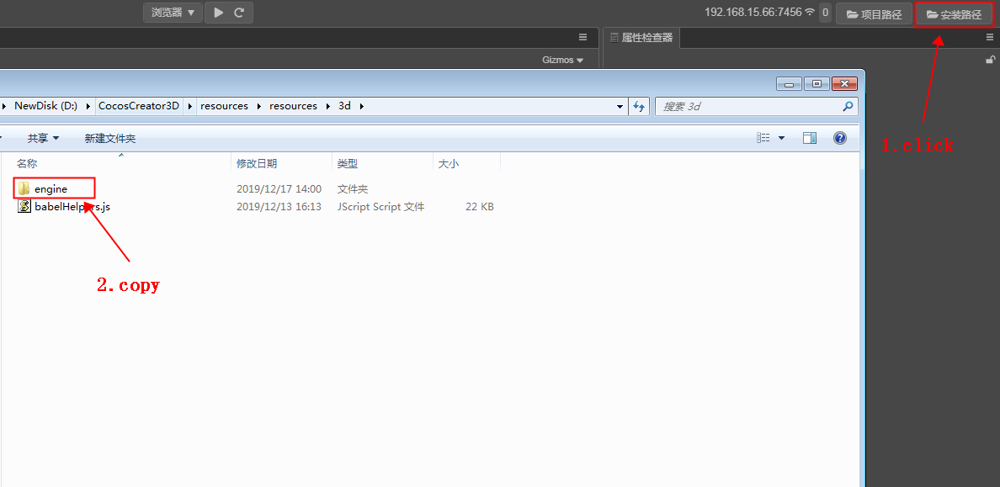
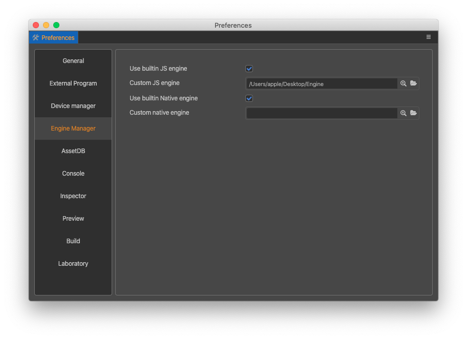
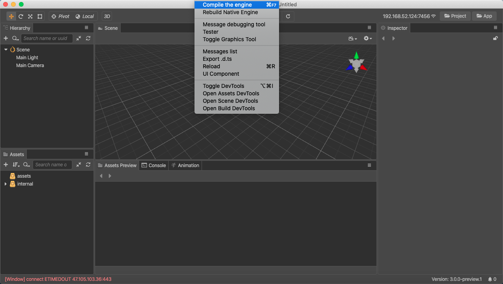

# Engine Customization Workflow

The engine part of Cocos Creator 3.0 includes JavaScript, Cocos2d-x-lite, and adapter (adapter engine customization is not supported at this time). The engine is all open-source on GitHub. The addresses are as follows:
 
- JavaScript engine: <https://github.com/cocos-creator/engine>
- Cocos2d-x-lite engine: <https://github.com/cocos-creator/cocos2d-x-lite>
- Adapter: <https://github.com/cocos-creator-packages/adapters>

It is recommended that you maintain your custom code through GitHub's Fork workflow so that you can easily update the custom parts when the engine is upgraded in the future, as described in [Fork a repo](https://help.github.com/articles/fork-a-repo). If you'd like to help Cocos get better and better, feel free to submit your changes to GitHub, see [How to Submit Code to Cocos](../../submit-pr/submit-pr.md). For more GitHub-related workflows, please refer to [GitHub Help](https://help.github.com).

Also, depending on the Creator version, you will need to switch to a different engine branch, for example:

- **3d-vX.Y** branch: the branch that corresponds to the X.Y version

It is usually recommended to use the same branch as the version of the Creator used.

## 1 Customize the JavaScript engine

If you only need to customize the engine functionality of the web version of the game, or if you only need to modify the pure JavaScript layer logic (e.g. UI system, animation system), you can simply modify the JS engine by following the procedure below:

### 1.1 Get the JS engine

You can modify the engine based on the one built in Cocos Creator 3.0 if you just need to make some adjustments based on the current version. Click the **App** button at the top right of the Creator editor, and then copy the built-in **engine** directory to another local path.



To get the latest official version in development, you need to fork or clone the original version of the JavaScript engine from GitHub (see above), and switch the corresponding branch of the JavaScript engine according to the Creator version before using it. Once downloaded, store it to any local path.


### 1.2 Modify the JS Engine Path

Set the path of the JavaScript engine to be customized via the **Engine Manager** tab of **Cocos Creator -> Preferences**.



### 1.3 Install Compilation Dependencies

```bash
### Go to the engine path in the command line
cd E:/engine
# Install the gulp build tool
npm install -g gulp
# Install dependent modules
npm install
```

> **Note**: the gulp build tool is required to generate debuginfos.

### 1.4 Make changes and compile

Next you can customize the engine modifications, after which please continue on the command line by executing:

```bash
npm run build
```

You can also build it in Cocos Creator with the **Developer -> Compile the Engine** option.



This command will generate a `bin` folder under the engine directory and compile the engine source code under the `bin` directory.


## 2 Customize the Cocos2d-x-lite Engine

If you need to customize the engine features related to the native platform, you may need to modify the Cocos2d-x engine in parallel with the JS engine.

### 2.1 Get the Cocos2d-x-lite Engine

If you only need to make some tweaks based on the current version, you can modify the Cocos2-x-lite engine built into Cocos Creator 3.0. The procedure is the same as for the JS engine: click the **App** button at the top right of the Creator editor, then copy the built-in cocos2d-x directory to another local path.

To get the latest official version in development, you need to download or clone it from the GitHub repository specified above. Similar to the JS engine, the Cocos2d-x-lite engine should be checked for the current branch before use.

### 2.2 Initialization

After downloading or cloning the Cocos2d-x-lite engine repository, go to the engine path at the command line and execute the following command:

> **Note**: if you copied the built-in cocos2d-x-lite directory from the editor, you can skip this step.

```bash
# Go to the Cocos2d-x-lite engine path at the command line
cd E:/cocos2d-x-lite
# Install the gulp build tool
npm install -g gulp
# Install dependent modules
npm install
# Initialize the repository
gulp init
```

### 2.3 Configure a Custom Nnative Engine in Cocos Creator 3.0

Set the path to the Cocos2d-x-lite engine to be customized via the **Engine Manager** tab of **Cocos Creator -> Preferences**.


### 2.4 Modify the Engine

Next you can make custom changes to the Cocos2d-x-lite engine. Since the code is only compiled during the **build release** process, you can directly open the **build release** panel after modifying the engine and select the `default` or `link` template to build and compile.
